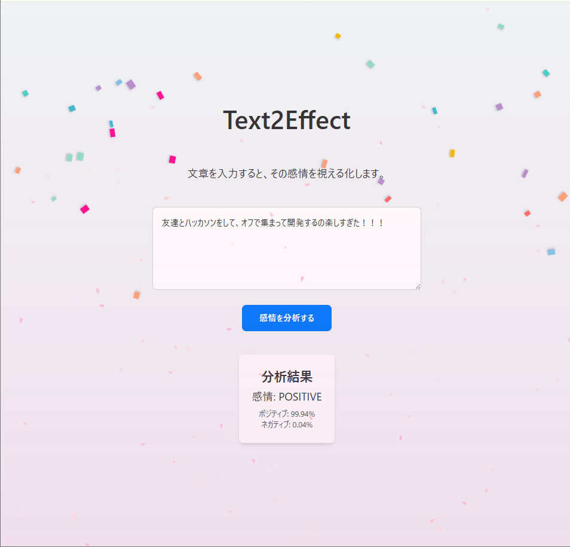

# Text2Effect

React + Python(Flask) + AWS Comprehend(感情分析AI) で作った、感情を分析し、それに応じたエフェクトがでるアプリです。

---
# セットアップ手順

## フロントエンド
1. `/Text2Effect`フォルダに移動
2. `npm install`を実行

## バックエンド
1. `/Text2Effect`フォルダに移動
2. `pip install python-dotenv boto3 flask flask-cor`を実行

### .envの作り方(AWSキー)
```
MY_ACCESS_KEY = "AWSアクセスキー"
MY_SECRET_KEY = "AWSシークレットキー"
```
---

# 起動方法

## フロントエンド
1. `/Text2Effect`フォルダに移動
2. `npm run dev`を実行

## バックエンド
1. `/Text2Effect/Backend/api`フォルダに移動
2. `python api.py`を実行

---
## デモ画像


